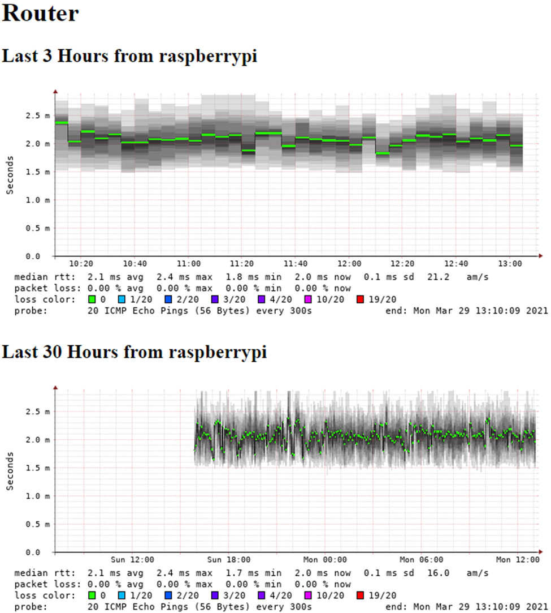

Writeup for a project I did as part of the interview process for my internship at CSNW

1.	Connect Raspberry Pi to monitor and performed install of Raspberry Pi OS
2.	Once install is finished, enable SSH by clicking the Pi logo in the top left and navigating to Preferences, Pi Configuration, and selecting the Interfaces tab
3.	Shutdown Raspberry Pi, unplug from monitor, and connect to router with ethernet cable
4.	Power on the Raspberry Pi and SSH into it from desktop
5.	Check for updates with sudo apt update && sudo apt upgrade
6.	Install smokeping with sudo apt install smokeping
7.	Open a web browser and navigate to IP of Pi/cgi-bin/smokeping.cgi
8.	To add targets for smokeping, to /etc/smokeping/config.d and edit the file Targets
9.	Save the file and restart smokeping with the command service smokeping restart
10.	To view the graphs created by smokeping, navigate back to the web interface and click on Local
11.	Let smokeping run for about 12 hours to gather enough data to generate a graph

Future Plans:
In the future I would like to use smokeping monitor the latency of multiple DNS servers and compare their latency with my ISPs DNS servers. I could use this to see if I would get better performance from switching to a different DNS server. If the data shows that another DNS server has lower latency, I will try switching to it and see if there is a noticeable difference in internet browsing speed.

